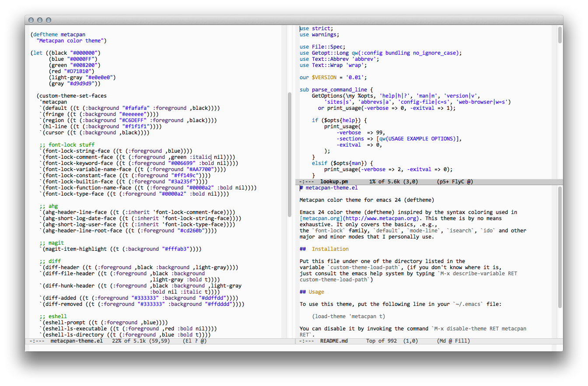

# metacpan-theme.el

Metacpan color theme for emacs 24 (deftheme)

Emacs 24 color theme (deftheme) inspired by the syntax coloring used in
[metacpan.org](http://www.metacpan.org). This theme is by no means
exhaustive. It only covers the basics, .e.g.,
the `font-lock` family, `default`, `mode-line`, `isearch`, `ido` and other
major and minor modes that I personally use.

##  Installation

Put this file under one of the directory listed in the
variable `custom-theme-load-path`, (if you don't know where it is,
just consult the emacs help system by typing `M-x describe-variable RET
custom-theme-load-path`)

## Usage

To use this theme, put the following line in your `~/.emacs` file:

    (load-theme 'metacpan t)

You can disable it by invoking the command `M-x disable-theme RET metacpan
RET`.

## Screenshot

